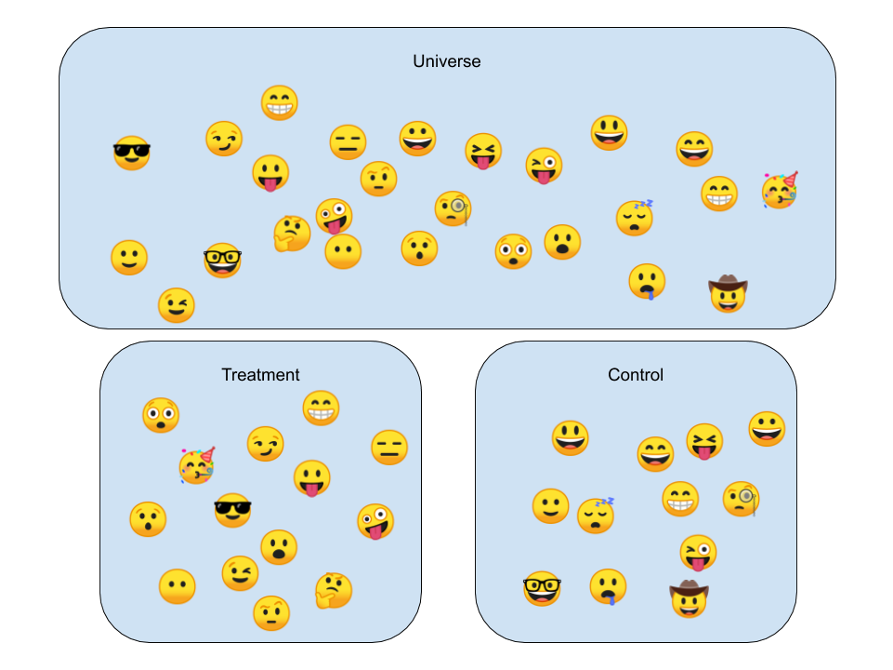
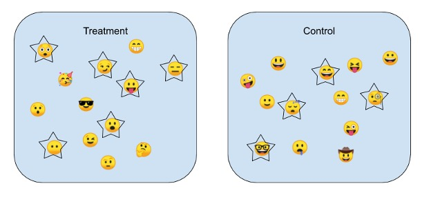
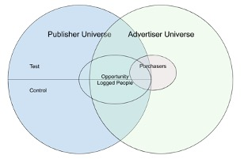
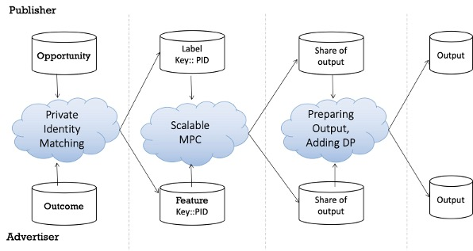

# Private Randomized Controlled Trial
*Mahnush Movahedi, Andrew Knox, Erik Taubeneck, Gary Zhao, Logan Gore, Li Li*

## Summary

The Private Computation Framework (PCF) library builds a scalable, secure and distributed private computation platform to run secure computation on a production level. As interesting application on top of PCF, we implemented a library that allows developers to perform randomized controlled trials without leaking information about who participated or what action an individual took. Private RCT is suitable for conducting A/B testing or measuring advertising lift and learning the aggregate statistics without sharing information on the individual level.

## Randomized Controlled Trials

Randomized Controlled Trials (RCT) are one of the most reliable ways to gather scientific evidence. It is a powerful way to show causation and reduce many forms of bias. The basis of an RCT is that the population being studied is randomly assigned to two or more groups - usually a test group that receives a specific intervention or treatment and a control group that does not. Lift is the estimate of the causal treatment effect on a specific outcome event, measured by observing the increase – or lift – of the test group over the baseline control group.

We discuss a technique for calculating a lift result privately without revealing information about individual people between companies, providing a high degree of individual privacy and consumer protection. Our previous tests have shown this technique can measure experimental results with up to 500 million unique rows, and we are now releasing the library that we developed to conduct these tests. We hope this open source release helps other developers working on RCT make their code more private and secure and that the additional scrutiny improves this library.

We focus on lift, using RCT to measure the effect of advertising on incremental sales. Consumers in the test group have an opportunity to see a specific ad, consumers in the control group have the ad withheld so that they do not see it within the study period. At the end of the lift study, the business counts up how many people in the test group made purchases after observing the advertisement and compares it to how many people in the control group made purchases. If there is a statistically significant difference between the groups, they can use this information to understand how much this ad helped their sales.

## Causality and the anatomy of an RCT

If you were to graph a time series of ice cream sales and shark attacks, you’ll see both spike together. Dig in a little further, and look at your probability of being attacked by a shark, conditional on whether or not you ate ice cream in the last two weeks, and you’ll see a statistically significant increase from eating ice cream! Have our finned fiends at the beach grown a sweet tooth? Could eating ice cream put you at a higher risk of being attacked by a shark?

Short answer: no. Ice cream does not cause shark attacks (nor do shark attacks cause ice cream sales.) Both just happen more often when it’s hot outside.

When we want to scientifically measure a causal relationship, the gold standard of experimental design is a randomized controlled trial (RCT). When we want to measure the causal effect of treatment A on outcome B, an RCT uses randomization to assign people to either a treatment group or a control group.

People are not made aware of their membership in either group, but only the treatment group receives the treatment A, and the outcome B is observed in both groups. Randomization allows us to assume that the treatment group and control groups are independent on all variables except for treatment A. Thus, any difference in outcome B between the groups can be established as the causal effect of treatment A on outcome B. Running an RCT and computing this difference is often called a lift test, as it measures the lift in outcome B due to treatment A.

Lift tests are used extensively online, to test different versions of a product (A/B test) or to measure the causal effect of advertising. These use cases are foundational technology that businesses all over the world rely on to help them make decisions about their product development, marketing, and advertising.

It is common in this type of lift test that there is one party (e.g. website or business) that knows the mapping for how individuals are randomized into test and control groups while a different party knows the outcomes that the treatment was meant to affect (e.g. whether or not an individual took a specific action). These parties may wish to collaborate to calculate aggregate statistics of how the different treatment groups performed in order to make an inference about how different versions of a product perform or understand if their advertising caused increased sales.

However, there is a problem. In order to calculate the lift test results, individual people in the test and control groups need to be matched across the different parties, and the aggregate results of the matched information needs to be calculated. Naively matching and sharing this data leaks information about individuals and the actions they take online, contributing to the proliferation of tracking user behavior online.

## Example to Understanding a Basic Lift Study

Consider two companies, Shoes.shop - an online shoe retailer, and Ad.network, an integrated online advertising platform. Shoes.shop is not sure how much of their sales come from online advertising, as opposed to other forms of marketing like email promotions, television ads, or word-of-mouth. They arrange for Ad.network to run a lift study - Ad.network will randomly select a fraction of people whom they serve ads to and choose to not show any of those people any ads related to Shoes.shop for several weeks. These people who will not see the ads for Shoes.shop are the control group, which is also called the holdout group. Shoes.shop will continue to otherwise buy ads normally, and Ad.network will continue to show the ads normally to everyone in the test group, also called the treatment group. At the conclusion of the several week study period, Shoes.shop and Ad.network will calculate how many people in the test group bought shoes and how many people in the control group bought shoes.

### Better Statistics - Opportunity Logging

When running a lift test, randomization happens for the entire universe of people who could potentially receive treatment. However, in many settings, only a subset of people may actually have the opportunity to receive treatment. By opportunity, we mean that a person is selected to receive treatment, but just before treatment is administered, that person's group assignment is checked. If they are in the treatment group, it is administered, and if they are in the control, it is withheld, and, in both cases, that opportunity is logged.

In the case of an online advertising campaign, the universe of people is often huge (in the billions) but the number of people with an opportunity to see the ad is typically much smaller. Thus, observing the statistical difference between those with opportunities allows for more precise inference.

This adds a new privacy concern, however. Revealing that a person is in a treatment or control group is just a random value, but revealing the fact that they had an opportunity could reveal much more information, such as demographics used for targeting of the advertising campaign. (Note: revealing a person’s treatment/control group assignment isn’t entirely private, as it could reveal membership in a group, which we often want to avoid in general. Opportunity logging, though, can reveal much more information.)

## Private Lift
### High-level Design
Private lift is a three-stage protocol. The first stage uses the private matching technology solution to create a joined set ordered based on IDs without revealing membership. The second stage runs multiple instances of a general purpose secure two party protocol over a sharded database to aggregate statistics about each experimental group while discarding individuals who took an action before they received treatment. The third stage adds distributed and calibrated Differential Privacy (DP) noise to the aggregate statistics and uncertainty measures, providing formal two-sided privacy guarantees. In this repository, our focus is on stage two: how to securely compute the statistics.

